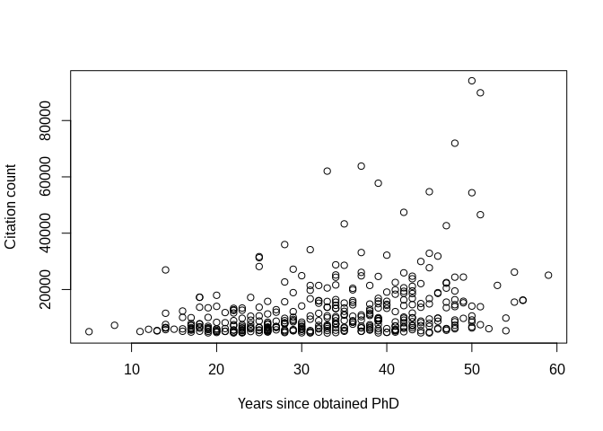
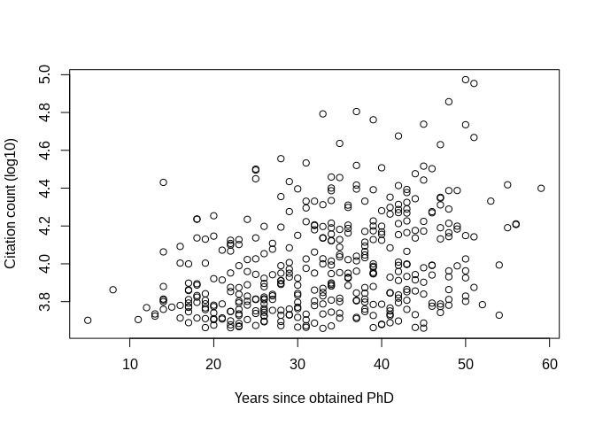
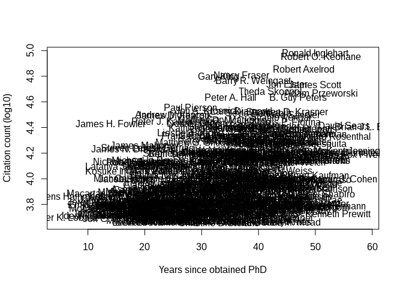
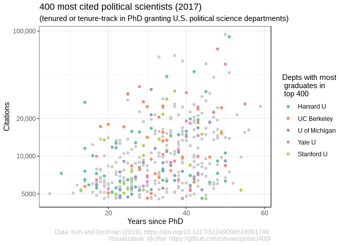

The Political Science 400
================
Ole Hexel
January 6, 2019

-   [The data](#the-data)
-   [Cleaning the data](#cleaning-the-data)
-   [Let the plotting begin](#let-the-plotting-begin)

This is an analysis of some of the data in Kim and Grofman's ["The Political Science 400"](https://www.cambridge.org/core/journals/ps-political-science-and-politics/article/political-science-400-with-citation-counts-by-cohort-gender-and-subfield/C1EDBF7220760F01A5C4A685DB3B3F44/core-reader) ([data](https://www.cambridge.org/core/journals/ps-political-science-and-politics/article/political-science-400-with-citation-counts-by-cohort-gender-and-subfield/C1EDBF7220760F01A5C4A685DB3B3F44/core-reader)): "a database with the 4,089 currently tenured or tenure-track faculty, along with emeritus faculty, at US PhD-granting departments ca. 2017-2018." It started out as an exercise to apply what I learned about extracting text from pdfs thanks to [Christina Maimone](https://github.com/cmaimone) and the Text Coding Group at Northwestern University. Turns out extracting the text from the pdf was one of the simpler bits. Getting the extracted text into a tidy format was such a pain, that I decided to write it up.

The data
========

The authors do not publicly provide their data as far as I can see. [Appendix A](https://static.cambridge.org/resource/id/urn:cambridge.org:id:binary:20190104104300674-0444:sup-mat:20190104104300674-0444:S1049096518001786sup002.pdf) provides data on the 400 most cited faculty. The table containts names, current (2017) school of employment, PhD-granting institution, year of PhD, and citation counts. According to the authors, the full dataset also contains fields of interest and gender.

Tables 1 to 5 in the article show different summaries of the data, including, among others, information on emeritus faculty and gender. The tables are `png` files. Another challenge could be to try to extract data from them.

There are at least three problems with the data as extracted from the pdf. One, the information on gender and specialties is missing. There are good reasons to think that these matter for citations. Second, the data is truncated in at least two ways. Appendix A only covers the 400 most cited faculty, instead of the 4,089 that make up the entire dataset. Any patterns observed among the top 400 are unlikely to apply to the entire population. In addition, the eligibility rules of the dataset ignore any faculty that left the field before the data collection in 2017 (e.g. retirement, emeritus, other career changes). The same rules also rule out non-Tenure-track faculty and faculty not in political science departments. I don't know the literature on citation practices in U.S. political science enough to judge whether these are justifiable on substantial grounds or whether they are due to practical reasons.

Cleaning the data
=================

``` r
# Some of the code could be simplified with use of appropriate tidyverse 
# packages. I prefer to err on the side of loading fewer packages. Even
# ggplot and ggrepel are not strictly necessary, but I don't know base graphics
# well enough to quickly replicate the plots.
library(pdftools)
library(here)
library(ggplot2)
library(ggrepel)

## To download the pdf with the table:
#pdfurl <- "https://static.cambridge.org/resource/id/urn:cambridge.org:id:binary:20190104104300674-0444:sup-mat:20190104104300674-0444:S1049096518001786sup002.pdf"
#download.file(pdfurl, destfile = "polisci400.pdf", method = "wget")

# I assume that the script and the pdf are in the same directory. Adjust
# accordingly, using setwd() or here() as you prefer. Beware the wrath of Jenny
# Bryan: https://www.tidyverse.org/articles/2017/12/workflow-vs-script/.
txt <- pdf_text("polisci400.pdf")
ft <- strsplit(txt, "\\n")
```

A look at the pdf suggests that the table was exported from a spreadsheet program to a pdf. Instead of programmatically reading in the variable names, I remove the header rows and add variable names manually.

``` r
ft[[1]] <- ft[[1]][4:length(ft[[1]])]
ft2 <- data.frame(firstname = character(),
                         lastname = character(),
                         unow = character(),
                         uphd = character(),
                         yearphd = character(),
                         citecount = character())
# I know, for loops are heresy.
for (page in 1:length(ft)){
    # trim whitespace at beginning and end of each line; otherwise, our boundary
    # finding will be thrown off.
    newpage <- trimws(ft[[page]])
    leftboundaries <- Reduce(intersect, gregexpr("[[:space:]][[:alnum:]]",
                                                 newpage))
    # There is a quicker way to find boundaries:
    # library(stringr)
    # str_split(string, boundary("word"))
    # But that does not overcome the "U of W" v "John O. Horkheimer" problem.
    leftboundaries <- c(0, leftboundaries)
    rowlength <- max(nchar(newpage))
    wordlengths <- diff(c(leftboundaries, rowlength))
    rightboundaries <- leftboundaries + wordlengths
    # Call substring on each row and split it into chunks defined by l/r
    # boundaries.
    obs <- lapply(newpage, substring, leftboundaries, rightboundaries)
    # The last colum is right-aligned, which means that if citation counts
    # change order of magnitude (i.e. from 5 to 4 digits), the last two rows are
    # concatenated.
    if (length(leftboundaries) < 6){
        obsbyrow <- matrix(unlist(obs), ncol = 5, byrow = TRUE)
        df <- data.frame(obsbyrow, stringsAsFactors = FALSE)
        names(df) <- c("firstname", "lastname", "unow", "uphd", "yearphd")
        yearphd <- gsub("([[:digit:]]+)[[:space:]]+[[:digit:]]+","\\1",
                        df$yearphd)
        citecount <- gsub("[[:digit:]]+[[:space:]]+([[:digit:]]+)", "\\1",
                          df$yearphd)
        df <- cbind(df[,c(1:4)], yearphd, citecount)
    } else {
        obsbyrow <- matrix(unlist(obs), ncol = 6, byrow = TRUE)
        df <- data.frame(obsbyrow, stringsAsFactors = FALSE)
        names(df) <- c("firstname", "lastname", "unow", "uphd", "yearphd", "citecount")
    }
    # trim whitespace
    dfclean <- data.frame(lapply(df, trimws))
    ft2 <- rbind(ft2, dfclean)
}
str(ft2)
```

    ## 'data.frame':    400 obs. of  6 variables:
    ##  $ firstname: Factor w/ 285 levels "Adam","Andrew",..: 23 22 21 17 7 4 12 8 27 1 ...
    ##  $ lastname : Factor w/ 371 levels "Axelrod","Benhabib",..: 11 14 1 8 15 29 4 26 28 24 ...
    ##  $ unow     : Factor w/ 85 levels "Columbia U","Cornell U",..: 10 8 10 5 4 8 1 17 4 6 ...
    ##  $ uphd     : Factor w/ 78 levels "Caltech","Cornell U",..: 10 3 17 8 15 1 13 17 3 5 ...
    ##  $ yearphd  : Factor w/ 49 levels "1962","1966",..: 3 2 4 12 15 11 7 3 9 2 ...
    ##  $ citecount: Factor w/ 395 levels "26092","26167",..: 29 28 27 26 25 24 23 22 21 20 ...

``` r
knitr::kable(head(ft2))
```

| firstname | lastname  | unow                           | uphd                   | yearphd | citecount |
|:----------|:----------|:-------------------------------|:-----------------------|:--------|:----------|
| Ronald    | Inglehart | U of Michigan                  | U of Chicago           | 1967    | 94125     |
| Robert O. | Keohane   | Stanford U                     | Harvard U              | 1966    | 89856     |
| Robert    | Axelrod   | U of Michigan                  | Yale U                 | 1969    | 71958     |
| Nancy     | Fraser    | New School for Social Research | SUNY                   | 1980    | 63820     |
| Gary      | King      | Harvard U                      | U of Wisconsin Madison | 1984    | 62048     |
| Barry R.  | Weingast  | Stanford U                     | Caltech                | 1978    | 57747     |

``` r
write.csv(ft2, file = "polisci400.csv")
```

Looks good. Except that everything is a factor?! (Oh `R`, why? I know it's probably my fault.) We want to change that. In addition, it seems more intuitive to create a variable "years since PhD" rather than PhD year and to concatenate first and last names. I'm sure there are cool analyses to be done on the distribution of the first letters of surnames, but I cannot think of any right now.

Let the plotting begin
======================

So far, this document is severely lacking in pictures. Let's change that.

Of course, the question on everyone's mind is whether "older == better" ?

``` r
plot(ft2$phdago, ft2$citecount,
     xlab = "Years since obtained PhD",
     ylab = "Citation count")
```



As with most skewed distributions, a simple scatter plot only tells us that there is a big blob where most people are, that there are some superstars, and that there are a few observations around the margins. Let us turn then to everyone's favorite linearizer, the `log10` function.

``` r
plot(ft2$phdago, log10(ft2$citecount),
     xlab = "Years since obtained PhD",
     ylab = "Citation count (log10)")
```



This looks nicer, doesn't it? But of course, what really interests us are names, right?

``` r
plot(ft2$phdago, log10(ft2$citecount), type = "n",
     xlab = "Years since obtained PhD",
     ylab = "Citation count (log10)")
text(x = ft2$phdago, y = log10(ft2$citecount), labels = ft2$fullname)
```



If we accept a linear relation between "years since PhD" and (log10 of) citation counts as a plausible simplification, people above the line of regression could be considered "wunderkinder" and those below "slow-burners" (I have just enough doubts about this simplification that I will not calculate the residuals and order individuals by them). James Fowler is a clear example of the former, and, even though they are hard to distinguish, so are Northwestern's very own Jim Mahoney and Jamie Druckman. Maybe a more interesting thing to consider would be the evolution of citations counts, as [Daniel Cressey](https://www.nature.com/news/sleeping-beauty-papers-slumber-for-decades-1.17615) and [Kieran Healy](https://www.nature.com/news/sleeping-beauty-papers-slumber-for-decades-1.17615https://www.nature.com/news/sleeping-beauty-papers-slumber-for-decades-1.17615) did for individual papers in order to identify "sleeping beauties" (i.e. articles that experienced an increase in citations long after their publication).

To make the names a little more distinguishable, I played around with `ggrepel`, but I haven't yet found a way to only apply it to observations around the periphery and not to the central mass. Applying it to all observations results in an unreadable cloud of names and arrows. Suggestions welcome.

``` r
# ggrepel example w/o output
p1 <- ggplot(data = ft2,
             aes(x = phdago, y = citecount, label = fullname)) +
    geom_text_repel(force = .2) +
    scale_y_log10() +
    theme_bw()
```

Other nice things to do would be to plot departments (of PhDs or of employment), specialties (if only we had the data), or gender.

And because we all care exclusively about the science and not about hierarchy, here are the top producers of much-cited faculty (not weighted by citation counts).

``` r
knitr::kable(head(sort(table(ft2$uphd), decreasing = TRUE), n = 10))
```

| Var1           |  Freq|
|:---------------|-----:|
| Harvard U      |    49|
| UC Berkeley    |    34|
| U of Michigan  |    29|
| Yale U         |    25|
| Stanford U     |    22|
| U of Chicago   |    20|
| Princeton U    |    15|
| U of Rochester |    13|
| Columbia U     |    12|
| MIT            |    12|

Let's see where the top 10's graduates are.

``` r
topfive <- c("Harvard U", "UC Berkeley", "U of Michigan", "Yale U", 
             "Stanford U")
ft2$uphd2 <- as.character(ft2$uphd)
ft2$uphd2[!ft2$uphd2 %in% topfive] <- NA
ft2$uphd2 <- factor(ft2$uphd2, levels = topfive)
p2 <- ggplot(data = ft2, aes(x = phdago, y = citecount, color = uphd2)) +
    geom_point(data = subset(ft2, is.na(uphd2)), color = "grey80") +
    geom_point(data = subset(ft2, !is.na(uphd2))) +
    labs(title = "400 most cited political scientists (2017)",
         subtitle = "(tenured or tenure-track in PhD granting U.S. political science departments)",
         x = "Years since PhD",
         y = "Citations",
         caption = "Data: Kim and Grofman (2019), https://doi.org/10.1017/S1049096518001786 \n Visualization: @olhxl  https://github.com/ohexel/polisci400/") +
    scale_color_brewer(palette = "Set2") +
    scale_y_log10(breaks = c(5000,10000,20000,500000,100000),
                  #labels = c("5*10^3","10^4","2*10^4","5*10^4","10^5")) +
                  labels = c("5000","10,000","20,000","50,000","100,000")) +
    guides(color = guide_legend(title = "Depts with most\n graduates in\n top 400")) +
    theme_bw() +
    theme(plot.caption = element_text(colour = "grey", size = 9))
p2
```



I'm not sure what this tells us. Someone more familiar with U.S. political science departments might be able to tell us.
